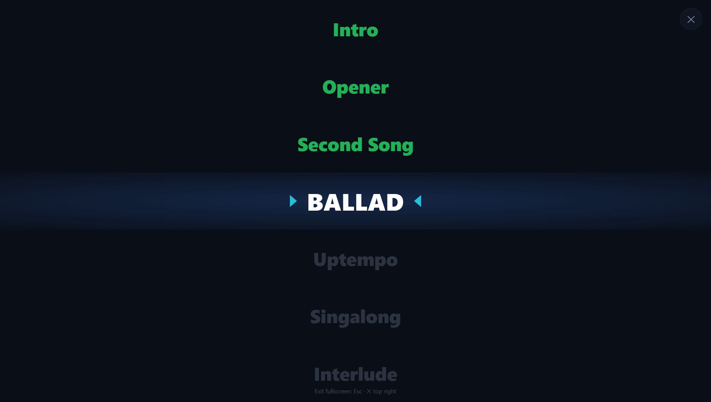

# Setlist Dashboard for Chataigne

A **live setlist display driven by the current song index** that your Chataigne state
machine already knows. Chataigne stays the show engine; this is only control and display.

Plain Node, **no npm dependencies**. Tested on Node 22.

---

## How it works

Every song state in your state machine gets **one extra consequence** that reports the
song's **index number** to a slim custom module. The module forwards it over OSC to a small
Node server, which keeps the setlist, remembers the current and already-played songs, and
serves the web app.

```
  CHATAIGNE                                    your existing states, plus one consequence
  ─────────                                    ────────────────────────────────────────────
  state machine ──▶ triggers clips as before
        │
        └──▶ consequence: Command → "Setlist Index" → Set Current Song (Index)
                                  │
                          custom module "Setlist Index"
                                  │  OSC  /song/index <N>
                                  ▼
                      ┌──────── COMPANION (Node) ────────┐
                      │  stores setlist.json              │
                      │  tracks current + played songs    │
                      │  serves the web app               │
                      └────────────────┬──────────────────┘
                                       │  HTTP + SSE
                                       ▼
                    browser — laptop, tablet or an external display
```

Nothing about your clip triggering changes. The module only rides along.

**Why a separate web app instead of Chataigne's own dashboard?** Chataigne's built-in
dashboard is a fixed canvas rather than a data-driven, self-advancing song list, drag & drop
reordering only exists for manager items in the editor, and script parameters can neither be
reordered by dragging nor declared as color parameters. A small web app solves exactly that.

### Live view

Current song highlighted, played songs in their color, disabled songs hidden.


### Fullscreen for external displays

Control-free, and the running song is kept centred automatically.



### Setlist editor

Name, fixed index number, active switch and color per song; order by drag & drop.


---

## What's in the package

```
setlist-dashboard/
├── README.md
├── INSTALL.bat                       ← install the module (Windows, double-click)
├── START-DASHBOARD.bat               ← start the server (Windows, double-click)
├── lib/
│   └── setlist-engine.js             ← shared helpers (order / index)
├── test/
│   └── engine.test.js                ← unit tests (node test/engine.test.js)
├── chataigne-module/
│   └── Setlist Index/
│       ├── module.json               ← custom module (definition)
│       └── setlistIndex.js           ← custom module (logic)
└── companion/
    ├── server.js                     ← companion server (plain Node)
    ├── package.json
    └── public/
        └── index.html                ← web app: live dashboard + editor
```

`companion/setlist.json` is created on first save and is deliberately not in the repository —
it holds show data. Without it the server starts from a neutral example setlist.

---

## Setup

### The quick way (Windows)

| File | What it does |
|------|--------------|
| **`INSTALL.bat`** | checks Node, copies the module to `Documents\Chataigne\modules`, runs the self-test, warns if Chataigne is still open, optionally creates a desktop shortcut |
| **`START-DASHBOARD.bat`** | starts the server and opens the browser; warns up front if port 8080 or 8000 is already taken |

Double-click `INSTALL.bat`, restart Chataigne, then do steps 3 and 4 below. To use other
ports, set `set HTTP_PORT=8090` or `set OSC_IN_PORT=8010` in the same console first.

### The manual way

#### Step 1 — start the companion
```bash
cd companion
node server.js
```
→ `Dashboard: http://localhost:8080`, `OSC in: port 8000`. Nothing to install (Node ≥ 16).
Ports if needed: `HTTP_PORT=8080 OSC_IN_PORT=8000 node server.js`.

#### Step 2 — install the Chataigne module "Setlist Index"
1. Copy the folder `chataigne-module/Setlist Index/` into `Documents/Chataigne/modules/`.
2. In Chataigne: **Modules → ＋ → Custom → Setlist Index**.
3. Check the **OSC output** on the module: *Local* = on, *Remote Host* = `127.0.0.1`,
   *Remote Port* = **8000**. The module ships these as defaults, so a freshly added module
   should already be correct. If it is not — for example an instance still stored in the
   project from an older version — set them by hand here. **A wrong remote port is the most
   common reason nothing happens in the dashboard.**

#### Step 3 — attach the consequence to your states
On **every song state** in your state machine, in addition to your existing clip logic:

> **Consequence** · type **Command** · target **Setlist Index → Set Current Song** ·
> parameter **Index** = this song's fixed number

That index number is the song's identity and has to match the setlist in the dashboard.
(Alternatively you can use "Set Value" on the module parameter *Current Index Param* — it
behaves the same.)

#### Step 4 — build the setlist in the dashboard
Open **http://localhost:8080** → **EDIT SETLIST**: add songs (name, **index** = the numbers
from your states, active switch, color for "played"), drag them into display order **by the
handle ⠿**, then **Save & send**.

### Done

As the states run, Chataigne reports the index; the dashboard highlights the current song,
colors the played ones and hides the disabled ones.

---

## Using it

**LIVE**
- "Now playing" with the song name and position (*Song X / Y*).
- The setlist: **current song highlighted**, **played songs in their color**,
  **disabled songs hidden**, scrolling along automatically.
- **↺ Reset played marks**. Also available from Chataigne via the command *Reset Played*.
- Clicking a song sets it as "now" by hand — handy for testing without Chataigne.
- **⛶ Fullscreen** = a control-free view for external displays: just the songs, full width,
  top to bottom. The playing song is kept centred; at the very start and end it stays at the
  top or bottom instead of being centred artificially. Leave with **Esc** or the ✕ top right.

**EDIT SETLIST**
- Show name; per song: name, **fixed index number**, **active** switch, **color** (text color
  once played).
- **Drag & drop** by the handle ⠿ to reorder — the index number stays as it is.
- Add or delete songs, **Save & send**, export/import **JSON**.

---

## Data model `setlist.json`

```json
{
  "meta": { "name": "Show 2026" },
  "songs": [
    { "index": 1, "name": "Intro",  "enabled": true,  "playedColor": "#22c55e" },
    { "index": 2, "name": "Song 1", "enabled": true,  "playedColor": "#22c55e" },
    { "index": 3, "name": "Filler", "enabled": false, "playedColor": "#64748b" }
  ]
}
```

- **index** — the fixed identity, i.e. the number Chataigne reports. Reordering does not
  change it.
- **array order** — display order only (drag & drop).
- **enabled** — `false` hides the song from the live dashboard entirely.
- **playedColor** — text color once the song has been "now".

---

## OSC reference (Chataigne → companion, port 8000)

| Address        | Argument | Effect                                              |
|----------------|----------|-----------------------------------------------------|
| `/song/index`  | `int`    | current song (this index); also marks it as played  |
| `/song/reset`  | `1`      | clear the "played" marks                            |

`/song/index -1` (or the command *Clear Current*) means no song is active.

**Ports:** companion HTTP `8080` · companion OSC in `8000`.

---

## Tests

```bash
node test/engine.test.js     # 16 tests: index identity, order, hiding, position
```

Covers that the index stays a song's identity across reordering, that disabled songs drop
out of the active list, and that positions are computed against the active list only.

---

## Possible extensions

- Several external displays or tablets at once (SSE supports any number of clients).
- A "next song" preview or countdown.
- Reporting back into the Chataigne dashboard (current song name as a value).
- Fixed color schemes per show.
- Talking to Chataigne's own dashboard WebSocket (port 9999) directly, if you ever want to
  drop the companion.

---

## License

MIT — see [LICENSE](LICENSE).
