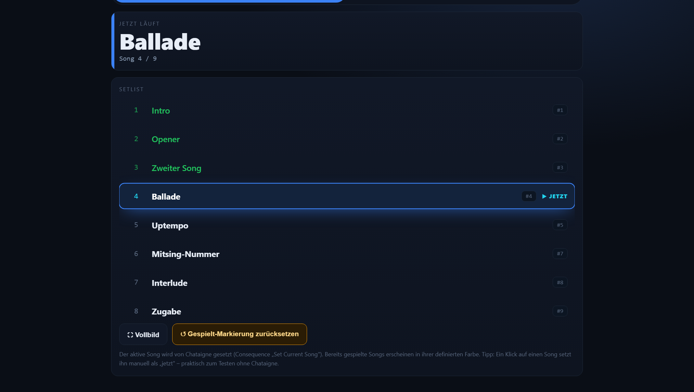
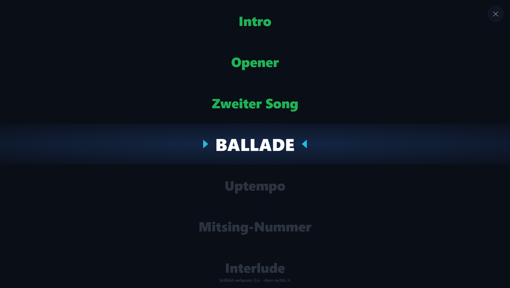
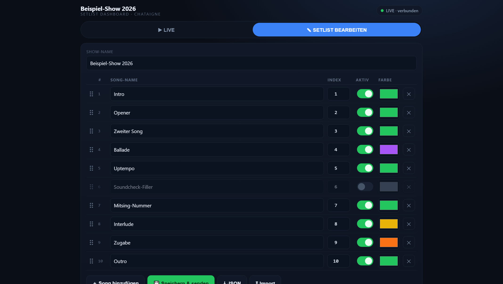

# Setlist Dashboard für Chataigne

Ein **Live-Dashboard mit variabler Setlist**, das optisch mitläuft — angetrieben durch den
**aktuellen Song-Index**, den eure bestehende Chataigne-State-Machine liefert.

Entwickelt für Groh-P.A. · Node 22 getestet · keine npm-Abhängigkeiten.

---

## Kurzfassung

Chataigne triggert die Clips wie bisher. Jeder Song-State meldet zusätzlich seine
**Index-Nummer** an ein schlankes Custom-Modul, das sie per OSC an einen kleinen
Node-Server schickt. Der Server hält die Setlist, merkt sich den aktuellen und die
gespielten Songs und liefert die Web-App aus — Live-Ansicht, Bühnen-Vollbild und
Setlist-Editor mit Drag&Drop.

**In drei Schritten:** `INSTALL.bat` doppelklicken → Chataigne neu starten und das Modul
hinzufügen → an jeden Song-State eine Consequence *Set Current Song* mit seiner
Index-Nummer hängen. Server starten mit `START-DASHBOARD.bat`, Dashboard auf
`http://localhost:8080`.

### Live-Ansicht

Aktueller Song hervorgehoben, gespielte Songs in ihrer Farbe, deaktivierte ausgeblendet.



### Vollbild für Bühne und Beamer

Controlfrei, der laufende Song wird automatisch mittig gehalten.



### Setlist-Editor

Name, feste Index-Nummer, Aktiv-Schalter und Farbe pro Song; Reihenfolge per Drag&Drop.



---

## 1. Das Konzept (was bleibt, was neu ist)

**Unverändert (euer bestehendes Setup):**
LTC läuft rein → Resolume synct → **Chataigne triggert die Clips** über eure Action-States
(AND aus Startzeit + Endzeit + „LTC Playing"). Daran fassen wir *nichts* an.

**Neu — wir setzen genau dahinter an:**
Jeder dieser States bekommt **eine zusätzliche Consequence**: er meldet die **Index-Nummer
des aktuellen Songs** an ein schlankes Custom-Modul. Das Modul reicht den Index an die
Web-App weiter, die daraus Setlist-Pflege und Live-Anzeige macht.

```
   ┌──────────────────────── CHATAIGNE (unverändert + 1 Consequence pro State) ───────────┐
   │                                                                                        │
   │  LTC ──▶ State-Machine ──(triggert wie bisher)──▶ Resolume-Clips                        │
   │              │                                                                          │
   │              └── zusätzliche Consequence:  Command → "Setlist Index" → Set Current Song │
   │                                                            │  (Index dieses Songs)      │
   │                                                   Custom-Modul "Setlist Index"          │
   └────────────────────────────────────────────────────────┬─────────────────────────────┘
                                                             │ OSC  /song/index <N>
                                                             ▼
                                        ┌──────────────── COMPANION (Node) ────────────────┐
                                        │  • speichert die Setlist (setlist.json)           │
                                        │  • merkt sich „gespielt", aktueller Song          │
                                        │  • liefert die Web-App aus                         │
                                        └───────────────────────┬───────────────────────────┘
                                                                │ HTTP + SSE
                                                                ▼
                                     Browser (Laptop / Tablet / Beamer-Screen)
                        ┌───────────────────────────────────────────────────────────┐
                        │  LIVE-Dashboard  +  Setlist-Editor (Drag&Drop, Farben …)   │
                        └───────────────────────────────────────────────────────────┘
```

**Warum die getrennte Web-App und nicht alles im Chataigne-Backend?**
Umsortieren per Drag&Drop gibt es in Chataigne nur für „Manager"-Items im Editor; das
eingebaute Web-Dashboard ist ein **festes Canvas** (kein datengetriebener, automatisch
durchlaufender Songlisten-View), und Script-Parameter lassen sich weder per Drag&Drop
umsortieren noch als Farb-Parameter anlegen. Eine schlanke Web-App löst genau das —
Chataigne bleibt die Show-Engine, die Web-App ist nur Bedienung + Anzeige.

---

## 2. Paketinhalt

```
setlist-dashboard/
├── README.md
├── INSTALL.bat                       ← Modul installieren (Windows, Doppelklick)
├── START-DASHBOARD.bat               ← Server starten (Windows, Doppelklick)
├── lib/
│   └── setlist-engine.js             ← gemeinsame Helfer (Reihenfolge/Index)
├── test/
│   └── engine.test.js                ← Unit-Tests (node test/engine.test.js)
├── chataigne-module/
│   └── Setlist Index/
│       ├── module.json               ← Custom-Modul (Definition)
│       └── setlistIndex.js           ← Custom-Modul (Logik)
└── companion/
    ├── server.js                     ← Companion-Server (reines Node)
    ├── package.json
    └── public/
        └── index.html                ← Web-App: Live-Dashboard + Editor
```

---

## 3. Einrichtung

### Der schnelle Weg (Windows)

| Datei | macht was |
|-------|-----------|
| **`INSTALL.bat`** | prüft Node, kopiert das Modul nach `Dokumente\Chataigne\modules`, läuft den Selbsttest, warnt wenn Chataigne noch offen ist, legt auf Wunsch eine Desktop-Verknüpfung an |
| **`START-DASHBOARD.bat`** | startet den Server und öffnet den Browser; warnt vorab, wenn Port 8080 oder 8000 schon belegt ist |

Doppelklick auf `INSTALL.bat`, Chataigne neu starten, fertig — danach nur noch
Schritt 3 und 4 unten. Andere Ports: vor dem Start `set HTTP_PORT=8090` bzw.
`set OSC_IN_PORT=8010` in derselben Konsole setzen.

### Der manuelle Weg

#### Schritt 1 — Companion starten
```bash
cd companion
node server.js
```
→ `Dashboard: http://localhost:8080`, `OSC-In: Port 8000`. Keine Installation nötig (Node ≥ 16).
Ports bei Bedarf: `HTTP_PORT=8080 OSC_IN_PORT=8000 node server.js`.

#### Schritt 2 — Chataigne-Modul „Setlist Index" installieren
1. Ordner `chataigne-module/Setlist Index/` nach `Documents/Chataigne/modules/` kopieren.
2. In Chataigne: **Modules → ＋ → Custom → Setlist Index**.
3. Am Modul den **OSC Output** prüfen: *Local* = an, *Remote Host* = `127.0.0.1`,
   *Remote Port* = **8000**. Das Modul bringt diese Werte als Default mit — bei einem neu
   hinzugefügten Modul sollten sie schon stimmen. Falls nicht (z. B. bei einem Modul, das
   noch aus einer älteren Version im Projekt liegt): hier von Hand setzen. **Ein falscher
   Remote Port ist die häufigste Ursache dafür, dass im Dashboard nichts passiert.**

#### Schritt 3 — Consequence an die States hängen
An **jeden Song-State** in eurer State Machine zusätzlich zur bestehenden Clip-Logik:

> **Consequence** · Typ **Command** · Ziel **Setlist Index → Set Current Song** ·
> Parameter **Index** = feste Nummer dieses Songs

Diese Index-Nummer ist die Identität des Songs und muss mit der Setlist im Dashboard
übereinstimmen. (Alternativ könnt ihr per „Set Value" den Modul-Parameter *Current Index Param*
setzen — wirkt identisch.)

#### Schritt 4 — Setlist im Dashboard bauen
Browser auf **http://localhost:8080** → **SETLIST BEARBEITEN**:
Songs anlegen (Name, **Index** = die Nummern aus euren States, Aktiv-Schalter, Farbe für
„gespielt"), per **Drag&Drop am Griff ⠿** in Anzeige-Reihenfolge bringen → **Speichern & senden**.

### Fertig
Beim Durchlaufen der States meldet Chataigne den Index; das Dashboard hebt den aktuellen
Song hervor, färbt gespielte Songs ein und blendet deaktivierte aus.

---

## 4. Bedienung

**LIVE**
- „Jetzt läuft" mit Songname + Position (*Song X / Y*).
- Setlist-Liste: **aktueller Song hervorgehoben**, **gespielte in ihrer Farbe**,
  **deaktivierte ausgeblendet**, automatisches Mitscrollen.
- **↺ Gespielt-Markierung zurücksetzen** (Reset). Geht auch aus Chataigne über den
  Command *Reset Played*.
- Klick auf einen Song = manuell als „jetzt" setzen (praktisch zum Testen ohne Chataigne).
- **⛶ Vollbild** = controlfreie Bühnen-/Beamer-Ansicht: nur die Songs, volle Breite, von oben
  nach unten. Der spielende Song wird automatisch mittig gehalten; am Anfang/Ende bleibt er
  entsprechend oben/unten (kein künstliches Zentrieren). Verlassen mit **Esc** oder ✕ oben rechts.

**SETLIST BEARBEITEN**
- Show-Name; pro Song: Name, **feste Index-Nr**, **Aktiv**-Schalter, **Farbe** (Textfarbe wenn gespielt).
- **Drag&Drop** am Griff ⠿ zum Umsortieren — die Index-Nummer bleibt dabei unverändert.
- Song hinzufügen/löschen, **Speichern & senden**, **JSON** export/import.

---

## 5. Datenmodell `setlist.json`

```json
{
  "meta": { "name": "Show 2026" },
  "songs": [
    { "index": 1, "name": "Intro",  "enabled": true,  "playedColor": "#22c55e" },
    { "index": 2, "name": "Song 1", "enabled": true,  "playedColor": "#22c55e" },
    { "index": 3, "name": "Filler", "enabled": false, "playedColor": "#64748b" }
  ]
}
```

- **index** — feste Identität = die Nummer, die Chataigne meldet. Ändert sich beim Umsortieren nicht.
- **Array-Reihenfolge** — reine Anzeige-Reihenfolge (Drag&Drop).
- **enabled** — `false` blendet den Song im Live-Dashboard komplett aus.
- **playedColor** — Textfarbe, sobald der Song einmal „jetzt" war.

---

## 6. OSC-Referenz (Chataigne → Companion, Port 8000)

| Adresse        | Argument | Wirkung                                             |
|----------------|----------|-----------------------------------------------------|
| `/song/index`  | `int`    | aktueller Song (dieser Index); markiert ihn „gespielt" |
| `/song/reset`  | `1`      | „gespielt"-Markierungen zurücksetzen                |

`/song/index -1` (bzw. Command *Clear Current*) = kein Song aktiv.

**Ports:** Companion HTTP `8080` · Companion OSC-In `8000` · (Resolume/Chataigne wie gehabt).

---

## 7. Tests
```bash
node test/engine.test.js     # 16 Tests: Index-Identität, Reihenfolge, Ausblenden, Position
```
Verifiziert außerdem per End-to-End-Check: eingehende `/song/index`-OSC-Nachrichten setzen
den aktuellen Song und die Gespielt-Liste korrekt; Drag&Drop ändert die Reihenfolge, aber
nicht die Index-Nummer.

---

## 8. Mögliche Erweiterungen
- Mehrere Beamer-/Tablet-Ansichten gleichzeitig (SSE unterstützt beliebig viele Clients).
- „Nächster Song"-Vorschau / Countdown.
- Rückmeldung ans Chataigne-Dashboard (aktueller Songname als Value).
- Feste Farbschemata / Corporate-Farben pro Show.
- Optional: direkte Anbindung an Chataignes eigenen Dashboard-WebSocket (Port 9999), falls
  ihr den Companion später einsparen wollt.
